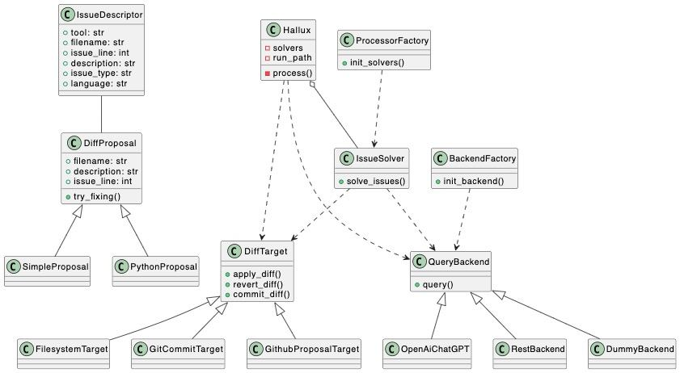

# Architecture

The key classes are:

 * **IssueDescriptor**: Contains metadata about a code issue.

 * **DiffProposal**: Abstract class for proposed code changes.

 * **SimpleProposal, PythonProposal**: Concrete implementations of proposals.

 * **DiffTarget**: Abstract target for applying proposals.

 * **FilesystemTarget, GitCommitTarget, GithubProposalTarget**: Concrete implementations of targets.

 * **QueryBackend**: Abstract class for backends that generate proposals.

 * **OpenAiChatGPT, RestBackend, DummyBackend**: Concrete backend implementations.

 * **BackendFactory**: Creates the backend based on config.

 * **IssueSolver**: Solves issues for a given language/linter.

 * **ProcessorFactory**: Creates IssueSolvers based on config.

 * **Hallux**: Orchestrates the whole process, has IssueSolvers and calls process().

So in summary, Hallux initializes the components, and then orchestrates the process of extracting issues, generating proposals, and applying them to targets. The components like backends and targets are pluggable.