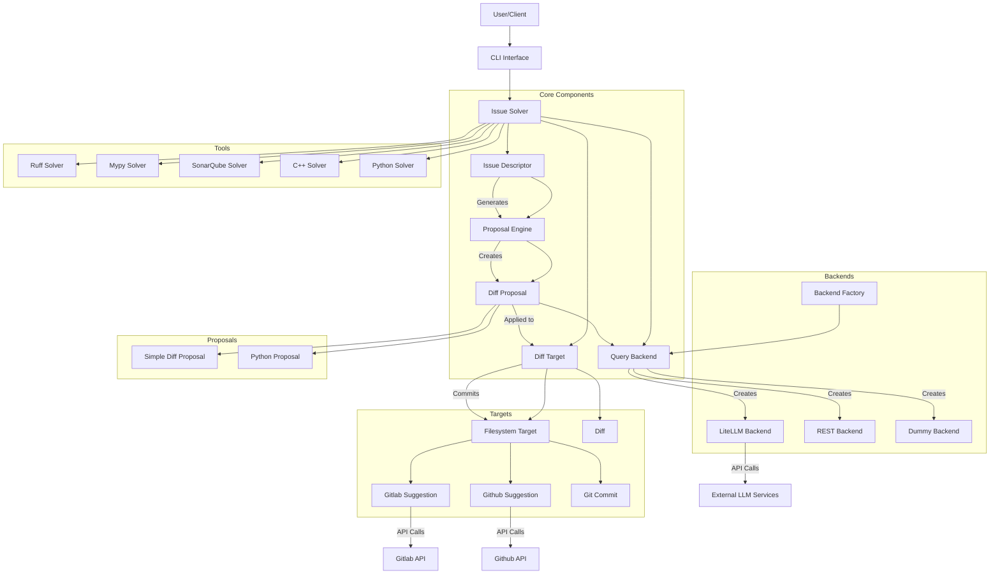

# Hallux System Architecture

## Component Descriptions

### Core Components

- **Issue Solver**: Orchestrates the process of identifying, solving, and applying fixes for code issues.
- **Issue Descriptor**: Represents a code issue with metadata like filename, line number, description, and issue type.
- **Proposal Engine**: Generates potential fixes (proposals) for issues.
- **Diff Proposal**: Represents a specific code change proposal to fix an issue.
- **Diff Target**: Interface for applying code changes to different targets (filesystem, git, etc.).
- **Query Backend**: Interface for querying LLM services to generate code fixes.

### Backends

- **Backend Factory**: Creates and configures different backend implementations.
- **LiteLLM Backend**: Integrates with various LLM providers through LiteLLM.
- **REST Backend**: Provides a REST API interface for backend services.
- **Dummy Backend**: A mock backend for testing purposes.

### Targets

- **Filesystem Target**: Applies changes directly to the filesystem.
- **Gitlab Suggestion**: Creates suggestions in Gitlab merge requests.
- **Github Suggestion**: Creates suggestions in Github pull requests.
- **Git Commit**: Commits changes directly to a git repository.

### Tools

- **Ruff Solver**: Handles Python linting issues detected by Ruff.
- **Mypy Solver**: Handles Python type checking issues detected by Mypy.
- **SonarQube Solver**: Handles issues detected by SonarQube.
- **C++ Solver**: Handles C++ specific issues.
- **Python Solver**: Handles Python specific issues.

### Proposals

- **Simple Diff Proposal**: Basic implementation of code change proposals.
- **Python Proposal**: Python-specific implementation of code change proposals.

## Data Flow

1. The user interacts with Hallux through the CLI interface.
2. Issue Solver identifies issues using various tool-specific solvers.
3. For each issue, a Proposal Engine generates potential fixes.
4. Query Backend uses LLM services to generate code fixes.
5. Diff Proposals are applied to the appropriate target (filesystem, git, etc.).
6. Changes are committed or suggested based on the target type.
